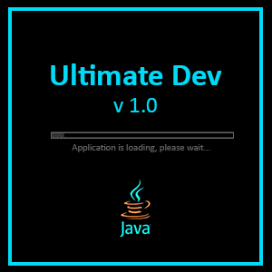

<!-- README.md template: https://github.com/othneildrew/Best-README-Template/blob/main/BLANK_README.md-->

<!-- PROJECT LOGO -->
<br />
<div align="center">
  <a href="https://github.com/github_username/repo_name">
    
  </a>

<h3 align="center">Ultimate Dev</h3>
  <p align="center">
    A quiz-style game show designed to determine who truly deserves the title of Ultimate Developer
    <br />
    <a href="https://github.com/ausdotsn50/ultimate-dev"><strong>Explore the docs »</strong></a>
    <br />
    <br />
    <a href="https://github.com/ausdotsn50/ultimate-dev">View Demo</a>
    &middot;
    <a href="https://github.com/ausdotsn50/ultimate-dev">Report Bug</a>
    &middot;
    <a href="https://github.com/github_username/repo_name/issues/new?labels=enhancement&template=feature-request---.md">Request Feature</a>
  </p>
</div>

<!-- ABOUT THE PROJECT -->
## About The Project
A quiz-style game show designed to determine who truly deserves the title of Ultimate Developer. 
Developed as a Machine Problem deliverable for CMSC 13: Surveys of Programming Paradigms.

### Overview
Unlike any ordinary coding task, winning this challenge requires both sharp theoretical knowledge and practical programming insight.

In the game, the player must answer a series of questions drawn from the topic: Surveys of Programming Paradigm. 
These questions range from fundamental theories to applied programming challenges across all lessons. The player may choose the order in which to answer the different lesson categories.

The game is a single-player, offline Java application, where the player competes solo but is not entirely alone. Along the way, they can rely on virtual allies called co-developers (CoDevs). 
These CoDevs are Java-programmed bots designed to simulate human developers from the gameshow “audience.” Each CoDev brings unique strengths and varying chances of answering correctly, serving as lifeline-style helpers during critical moments of the game.

*Only those who balance knowledge, strategy, and wise use of their CoDevs will rise to the top and claim the title of the **Ultimate Dev.***

### Built With
[![Java][Java]][Java-url]

<!-- GETTING STARTED -->
## Getting Started
Follow these steps to set up and run the project locally.

### Prerequisites
* **Build:** Java JDK 23+ 
* **Run:** Java JRE 17+
* **Tooling:** Apache Maven

### Installation

1. Clone the repository
   ```sh
   git clone https://github.com/ausdotsn50/ultimate-dev.git
   cd ultimate-dev
   ```
2. Compile and Run
- **Main.java**

## Game Mechanics
<!-- To add binaries -->
### Main Structure
- The game covers 7 main topics on Surveys of Programming Paradigms.
- Each topic is a major round.
- To win, the player must complete all 7 rounds (145 questions total).

### Question Flow
- At the start of each round, the player chooses which topic (category) they want to tackle.
- Each round contains more or less 20 multiple-choice questions, displayed in a random order containing:
  - Theoretical – fundamental principles and concepts.
  - Programming – applied coding and problem-solving.
- To clear a round, the player must answer all the questions without draining their attempts left.

### CoDevs (Helpers)
- The player has Java-programmed bot helpers called CoDevs, which simulate human developers from the gameshow audience.
- By default, the player starts with 2 CoDev calls. More can be earned by progressing.
- A CoDev can be summoned through pressing the C key:
  - Function: [Copy]
    - The player will be blocked from inputting an answer.
    - Instead, they fully copy the answer provided by CoDev.
    - The result depends entirely on the CoDev’s accuracy; correct if they’re right, wrong if they miss.
- CoDevs are randomly selected by an audience select randomizer; the player cannot pick their helper.

### Progression
After clearing each round, the player earns points by the system below.
- Round 1 - 100
- Round 2 - 150
- Round 3 - 250
- Round 4 - 400 
- Round 5 - 600 
- Round 6 - 850 
- Round 7 - 1150

Clearing all rounds guarantees 3500 points


<!-- ROADMAP -->
## Roadmap
- [ ] Implementing surrender functionality
- [ ] Adding a retry attempt after achieving the Ultimate Dev crown
- [ ] Enhancing game audio settings

<!-- See the [open issues](https://github.com/github_username/repo_name/issues) for a full list of proposed features (and known issues). -->

<!-- CONTRIBUTING -->
## Contributing
Follow these steps to contribute to the project:
1. Fork the Project
2. Create your Feature Branch (`git checkout -b feature/FeatureName`)
3. Commit your Changes (`git commit -m 'Add some FeatureName'`)
4. Push to the Branch (`git push origin feature/FeatureName`)
5. Open a Pull Request

<!-- LICENSE -->
## License
Distributed under the MIT License. See LICENSE for more information.

<!-- CREDITS -->
## Credits
### Developers
- Angela Denise Almazan - azalmazan@up.edu.ph
- Elizah Sumbeling - ebsumbeling@up.edu.ph

### AI Use Disclosure
The following AI models provided assistance with code review and debugging during development:
* **Gemini 3** 
* **ChatGPT 4**

<!-- MARKDOWN LINKS & IMAGES -->
<!-- https://www.markdownguide.org/basic-syntax/#reference-style-links -->
<!-- Shields.io badges. You can a comprehensive list with many more badges at: https://github.com/inttter/md-badges -->
[Java]: https://img.shields.io/badge/Java-%23ED8B00.svg?logo=openjdk&logoColor=white
[Java-url]: https://www.java.com/en/
[product-screenshot]: resources/image/UD_loadscreen.png
